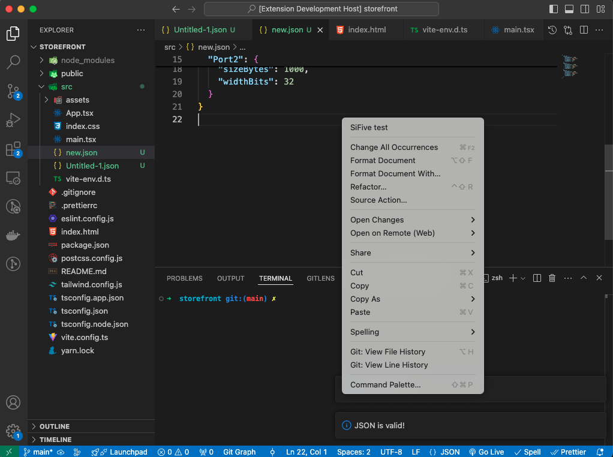

# JSONFormatter README

This is code is about VSCode extension

## Features

This VSCode extension will be validating the JSON file and add on functionality of validating the JSON data based on hardcode JSON schema.
 - Go To JSON File
 - Right Click on Editor, It will show Sifive Test
 - Selecting Sifive Test will result the JSON File Validation and if JSON Data is same as schema, it will check for the Overlap.

## Extension Settings

In case if it's not working on local machine please check the installed version of VSCode engine and replace the same version on package.json file.

  "engines": {
    "vscode": "1.94.2"
  },


## How to compile the extension?

Clone this Repo, and go to the Folder
 ```
  cd vsCodePlugin-jsonValidator
 ```

Once that is done run,
```
 npm install
```

Press `CMD + Shift + P` and Select for `Debug: Start Debugging`
 - it will open a new VSCode Window Know as Extension Development Host


## How to run the extension?
  - Go To Extension Development Host Window
  - Create a JSON File
  - Right Click on the editor

  <div align="center">
    
  </div>

  - Clicking on the `SiFive Test` will result you the JSON file validation and if provided schema is same as hard coded, it will result you in checking the overlap between ports

## How to run the test?
  Yet to Write
## Explanation of your test. Are they unit tests or integration tests?
  Yet to write
## Explanation of your logic and architecture
  - Used `Yeoman` and `generator-code` to scaffold a TypeScript or JavaScript project ready for development.

  - `npm install ajv` to compile JSON schema and validating it

  - Used the `contributes` and added required command to register the command and added command to show the Menu.
  - Registered the command, and used VS Code APIs to get the idea of currently selected file, fetched the File Path using it
  - If file path is available, using file system, reading the content of file
  - When file path is available, by using `JSON.parse` parsed the data, if data is getting parsed with any error, it shows that JSON data is valid, else it shows, JSON data is invalid
  - In case of Valid JSON Data, Run the command for validating the data against schema, if provided data is matched, wrote algorithm to find the overlap.  

## If you have more time, what do you want to improve?

**Enjoy!**
